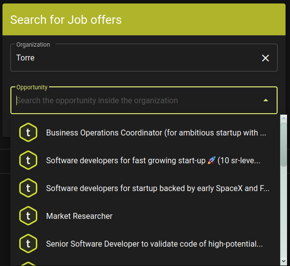

# Torre Comparison (Torre Technical Test)

What I chose as the test was to develop a new functionality. This new function is oriented to the recruiters who want to compare two candidate profiles. The work was divided in 4 users stories that are shown below:

- As a recruiter, I want to search for the opportunity which I am working on.
- As a recruiter, I want to search two people to compare.
- As a recruiter, I want to see how much those people’s skills match with the opportunity.
- As a recruiter, I want to compare other skills that candidates have.

## Search for an opportunity
The recruiter can find the opportunity via the *Search for Job offers* card. The name of the company who is offering the job should be entered in the organization field. Once the user typing stops, the opportunity list is updated. The user can select the desired one. An example is shown below:

## Search for candidates
The recruiter can select two candidates to compare their skills. In the candidate field, the recruiter can enter the name of the candidate, then, in the list select the wanted candidate in case the search returns several candidates. The photo can be helpful. Once selected a color is assigned to each candidate. An example is shown below:

## Compare skills
Once the information of the opportunity and the candidates is filled, the comparison of skills is shown. In the first card the recruiter can see the wanted skills for the position. The skills which need experience have a briefcase as an icon and the skills to develop have a graduation cap icon. Moreover, the experience skill can show the desired experience time. This is shown in this figure: 

On the other hand, the candidate skills are presented based on the opportunity skills. If the candidate has the experience skill as a strength the skill is shown in green and with a briefcase outlined. Moreover, if a developing skill meets with a strength it is shown also in green but with a briefcase full. Besides, if a developing skill is in the interest of the candidate is shown in blue. Otherwise, an experience skill which corresponds with an interest,  is shown in orange. If no condition meets, that means that the candidate does not have the skill neither in their strengths, nor in their interests, and it is shown in red with an alarm icon. All cases are displayed below:

## Other skills
Other comparison is shown once the data from the candidates and the opportunity is filled. In the first part, a summary of the number of strengths and interests of both candidates is exhibited. A list of each candidate's strengths and interests is displayed in the application as below. 

# Challenges
## Learning
Due to two of the skills required by the opportunity are Vue.js and Material design, I decided to make the project using those technologies. However, they are not in my expertise area, but I think that was a very interesting practice with a new topic. One of the things I like the more is to get new knowledge. 

## CORS restriction
One of the used endpoints has this restriction so seeking for solution I found the project of Rob Wu called [cors-anywhere](https://github.com/Rob--W/cors-anywhere). I deployed my own version in [https://cors-torre.herokuapp.com/](https://cors-torre.herokuapp.com/). It allows us to avoid this restriction, it is not the ideal solution but it works. 

# Potential work
This application allows recruiters to have a quick view of two candidates. Other information can be added. The next user stories are presented as desired as a future work: 
- As a recruiter, I want to compare the spoken languages by the candidates
- As a recruiter, I want to compare the timeline of the candidates
- As a recruiter, I want to compare the personality traits
- As a recruiter, I want to compare the professional culture traits

All the information is already retrieved and just needs to be shown. 

# Demo
**A demo of the application is deployed in [https://torre-comparasion.herokuapp.com/](https://torre-comparasion.herokuapp.com/)**

*Note: there is an intentional typo in the name of the app just to try to blur the intention of the project*
